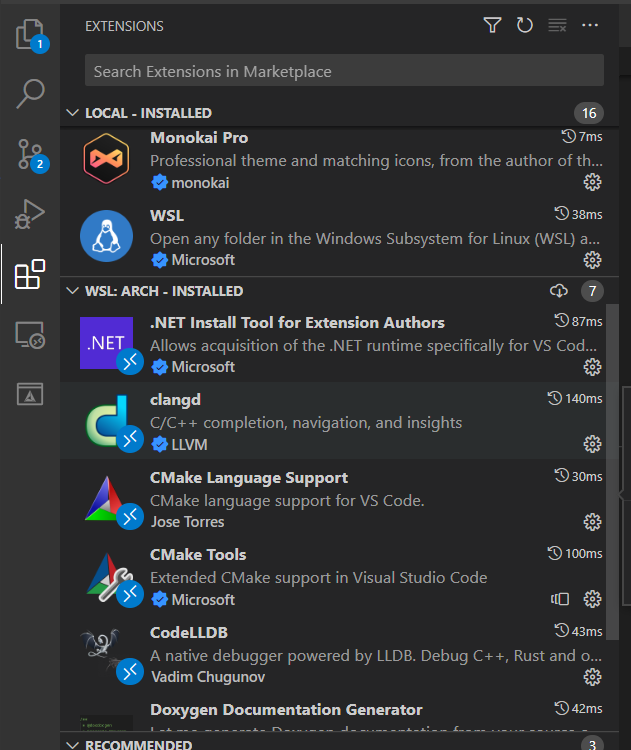

# 基于VSCODE+CMAKE+LLVM+NINJA 环境开发c/c++

## 系统环境配置
1. **WSL环境安装**
- *安装WSL*

    `wsl --install` # 安装wsl

    具体参见官方文档[wsl安装教程](https://learn.microsoft.com/zh-cn/windows/wsl/install)

- *安装Archlinux*

    具体安装步骤参见文档[How to Set Up ArchWSL](https://wsldl-pg.github.io/ArchW-docs/How-to-Setup/)

2. **ArchLinux环境配置**
* 更改镜像仓库访问地址

    `sudo vim /etc/pacman.d/mirrorlist`

    选择国内中科大镜像网址
    `https://mirrors.ustc.edu.cn/archlinux/$repo/os/$arch`
## Windows端开发工具安装
1. **安装VScode**
2. **安装wsl插件**
3. **安装clangd插件**
4. **安装CodeLLDB插件**
5. **安装CMake插件**
6. **安装CMake Tools 插件**
7. **安装CMake Language Support插件**
8. **安装Doxygen Documentation Generator插件**

插件如下



## ArchLinux开发工具安装

`sudo pacman -S llvm clang cmake ninja git`


## 现代 CMake 命令

`cmake -Bbuild -GNinja` #创建build文件夹 使用Ninjia构建工具配置项目

`cmake --build build` #编译项目


## MakList.txt文件编写
- **根目录下CMakeList.txt**
    ```cmake
    cmake_minimum_required(VERSION 3.17)
    if(NOT CMAKE_BUILD_TYPE)
        set(CMAKE_BUILD_TYPE Release)
    endif()
    set(CMAKE_CXX_STANDARD 20)
    set(CMAKE_CXX_STANDARD_REQUIRED ON)
    set(CMAKE_CXX_EXTENSIONS OFF)

    project(hello_test LANGUAGES CXX)
    add_subdirectory(hellolib)
    file(GLOB SRC_LIST CONFIGURE_DEPENDS src/*.cpp)
    add_executable(${CMAKE_PROJECT_NAME} ${SRC_LIST})
    target_link_libraries(${CMAKE_PROJECT_NAME} hellolib)

    ```

- **hellolib目录下CMakeList.txt**
    ```cmake
    file(GLOB SRC_LIST src/*.cpp)
    add_library(hellolib STATIC ${SRC_LIST})
    target_include_directories(hellolib PUBLIC include)
    ```
## Lunch.json文件配置

```js
{
    "version": "0.2.0",
    "configurations": [
        {
            "type": "lldb",
            "request": "launch",
            "name": "Debug",
            "program": "${command:cmake.launchTargetPath}",
            "cwd": "${workspaceFolder}",
            "internalConsoleOptions": "neverOpen",
            "terminal": "integrated",
            "stopOnEntry": true,
        }
    ]
}
```

